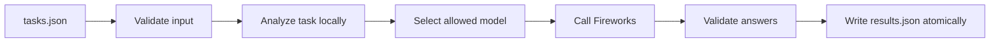

# TernRoute

<p align="center">
  <strong>A proof-gated, token-efficient task router for Fireworks AI — built for AMD Developer Hackathon: ACT II.</strong>
</p>

<p align="center">
  <a href="https://github.com/Noizrom/ternroute/actions/workflows/test.yml"></a>
  <a href="https://github.com/Noizrom/ternroute/pkgs/container/ternroute"></a>
  <a href="https://www.python.org/"></a>
  <a href="LICENSE"></a>
</p>

TernRoute is an entry for **Track 1 of the AMD Developer Hackathon: ACT II**. It reads a batch of natural-language tasks, determines their category and output constraints locally, and routes each task to an allowed Fireworks AI model. It spends no model tokens on routing and writes validated results atomically.

> Solve locally only when correctness is provable; otherwise route once, answer precisely, and stop.

## Why TernRoute?

- **Token-efficient** — task analysis and model selection happen locally.
- **Policy-safe** — every request uses an exact model from `ALLOWED_MODELS`.
- **Reliable** — requests have bounded concurrency, attempts, and deadlines.
- **Contract-driven** — input and output are strictly validated.
- **Operationally simple** — the runtime uses only the Python standard library.
- **Observable** — structured telemetry is emitted as JSON on stderr.

## How it works



## Video presentation

<p align="center">
  <a href="presentation/remotion/out/ternroute-modern.mp4"></a>
</p>

The 80-second presentation explains TernRoute's implemented request-classification, allowlist-selection, dispatch, retry, and telemetry flow.

- [Watch the 1080p presentation](presentation/remotion/out/ternroute-modern.mp4)
- [Read the synchronized transcript](presentation/remotion/TRANSCRIPT.md)
- [View the Remotion source](presentation/remotion/src/index.tsx)

## Live web demo

The repository root is a Vercel-ready interactive demo backed by the existing Python router.
Import the repository in Vercel and add these project environment variables:

- `FIREWORKS_API_KEY`
- `FIREWORKS_BASE_URL`
- `ALLOWED_MODELS`

Vercel serves `index.html` and deploys `api/route.py` as a Python Function. The API key stays
server-side; the browser receives only the selected route, parsed output contract, and answer.
The endpoint includes a small per-instance rate limit for demo traffic. Add a Vercel Firewall
rate-limit rule before sharing it broadly.

## Runtime contract

TernRoute accepts a JSON array at `/input/tasks.json`:

```json
[
  {"task_id": "t1", "prompt": "What is the capital of France?"}
]
```

It writes the matching results to `/output/results.json`:

```json
[
  {"task_id": "t1", "answer": "Paris"}
]
```

The runtime requires:

| Variable | Purpose |
| --- | --- |
| `FIREWORKS_API_KEY` | Authenticates requests to Fireworks AI. |
| `FIREWORKS_BASE_URL` | Sets the compatible Chat Completions endpoint. |
| `ALLOWED_MODELS` | Comma-separated model IDs that TernRoute may use. |

TernRoute never constructs or hardcodes a model ID; it always selects an exact value from `ALLOWED_MODELS`.

## Quick start

Pull the published image:

```bash
docker pull ghcr.io/noizrom/ternroute:latest
```

Prepare a task file and run the app:

```bash
mkdir -p local-run/input local-run/output
cp examples/tasks.json local-run/input/tasks.json

docker run --rm --platform linux/amd64 \
  -v "$PWD/local-run/input:/input:ro" \
  -v "$PWD/local-run/output:/output" \
  -e FIREWORKS_API_KEY \
  -e FIREWORKS_BASE_URL \
  -e ALLOWED_MODELS \
  ghcr.io/noizrom/ternroute:latest
```

Read the generated answers from `local-run/output/results.json`.

> For local development, tests, image builds, and publishing instructions, see [CONTRIBUTING.md](CONTRIBUTING.md).

## Project status

The remote-routing baseline is implemented and tested. Proof-gated local arithmetic and regex-only entity solvers are intentionally deferred until the remote baseline is measured and passing.

TernRoute was created for Track 1 of the **AMD Developer Hackathon: ACT II**. See [PLAN.md](PLAN.md) for the complete competitive build strategy and design rationale.

## License

TernRoute is available under the [MIT License](LICENSE).
